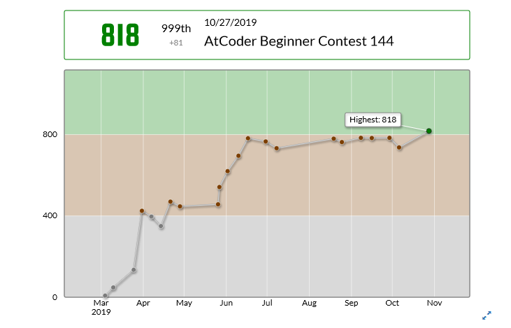

<b>このエントリは 6/16 までに下書きの大部分が書かれています．なんでや!!!</b>

## TL;DR

競プロをはじめて，ついに AtCoder で緑になりました!🎉 というわけで恒例の変色エントリです．緑になるまでの道のりを書こうと思いますが，「緑になるにはこれをして…」とかは少ないかもしれません．「はぁ，この人はここしばらくこんなことをして過ごしてきたんだな」とか思いながら気楽に読んでください．

## 2 月後半～ 3 月(競プロ開始)

時間は飛んでこの春．やりたいことの一覧を見てみると競プロが入っていたので，国公立前期試験が終わるやいなや C++環境を整えておもむろに競プロを始めました(あのとき前期は落ちた気でいたのに競プロを始めたのは謎)．

そして無事阪大に合格し，春休みは遊びと競プロでいっぱいになりました．この頃は阪大競プロ界隈が急に盛り上がるなんて思いもよりませんでした(たぶん．いつから勢いづいてきたのか正直覚えていない)．

## 4 月

キラキラ?大学生生活が始まり，精進量は目に見えて落ちました．

このころになるとさすがに AB 問題は 99％通せていたので C 問題を少しずつやっていこうと決めたわけですが，これが B 問題との差が大きく，なかなかはかどりません．いまだにはかどっていません．(このころは C の壁が大きかったのになぁ…?)

### ICPC

ICPC という大学対抗のプロコンがあるということなので「おもしろそう～」といいながら 4 月の終わりに参加の意思表明をしました．初出場なので不安もありますが心配してもしょうがないので~~楽しんでいきたいと思います．~~楽しかったです．

## 5 月

GW に はにーまさん主催の競プロ合宿・CPSCO があったので参加しました．普段 Twitter でしか見ない人たちが実体を持っていることに驚いたり(コラ)，初めてのチーム戦(チーム戦だいすき)をしたりとても充実した体験ができました．

この 4 完を皮切りにだんだん C 問題や，ときには D 問題まで通せるようになりました．

ただまぁ 4 完するとさすがに調子にも乗るのでこんな目標を立てました．

<blockquote class="twitter-tweet" data-lang="ja">
えーー年明けまでに水色目標ということでやっていきます
&mdash; いかなご (@ikanago987) <a href="https://twitter.com/ikanago987/status/1132666863719051266?ref_src=twsrc%5Etfw">2019年5月26日</a></blockquote>

~~このときは緑になるのは 8 月くらいだと思っていたので想定以上に順調に進んでいて，もしかすると本当に達成できるかもしれません．~~な～～にが 8 月だ，やっと緑になりました．目標を年度内水色に変更しました 😠．

### 空前のユーフォブーム

この春からアニメ「響け! ユーフォニアム」の劇場版が公開されており，阪大ではほとんどじゅぴろさんの影響で阪大界隈にユーフォが漂い始めました(ほんとに教祖です)．今回の映画の先行作品「リズと青い鳥」の上映会が開かれたりして，もはや競プロ界隈なのかユーフォ界隈なのか分からなくなっていました．ぼくも映画を観て涙を流し，また頑張ろうという気持ちになりました(ほんまか?)．

## 6 月

新 ABC が易化したからかはたまたユーフォを見に行ったからかコンテスト中に D まで通せることが多くなりました．ただこの月は精進が虚無で，他のプログラムを書いたりしていました．

## 7 月～ 9 月

**な ん も し て な い  
大 不 作  
空 前 の 虚 無**  
なんかテスト勉強と競プロ以外のコーディングをしてたら夏休みが終わってました．しょうがないね．

### 10 月

9 月の終わりに急に競プロに目覚めました．なんで? KUPC が近づいてたからですかね．  
1 人でばちゃを立てたりして C とか D を埋める日々を続けました．

## 覚えたこと

### アルゴリズム

-   にぶたん(まだまだ使いこなせてない)
-   累積和
-   imos 法
-   DFS(たまにバグらせる)
-   BFS(ちょっと怪しい スラスラとは書けない)
-   bit 全探索
-   gcd, lcm
-   素因数分解
-   約数列挙

bit 全探索とかはほとんど書いたことないですね．整数系の初等的なアルゴリズムは結構使えます．

### データ構造

-   C++の STL

そんなに特別なデータ構造は使ってません．`priority_queue`がかなり有用ですね．

## おわりに

緑になるまで半年くらいかかってしまいました(まぁ精進してなかったのでそれはそう)．

嬉しいんですが，今年度中の目標が水色なのでやっとスタートラインに立てた感じです．

まだやってない C/D 問題を埋めつつ，DP とかも覚えていきたいです． 標準ライブラリにないデータ構造(Union-Find 木とか)の勉強はそのうち，興味が出たらやります．
