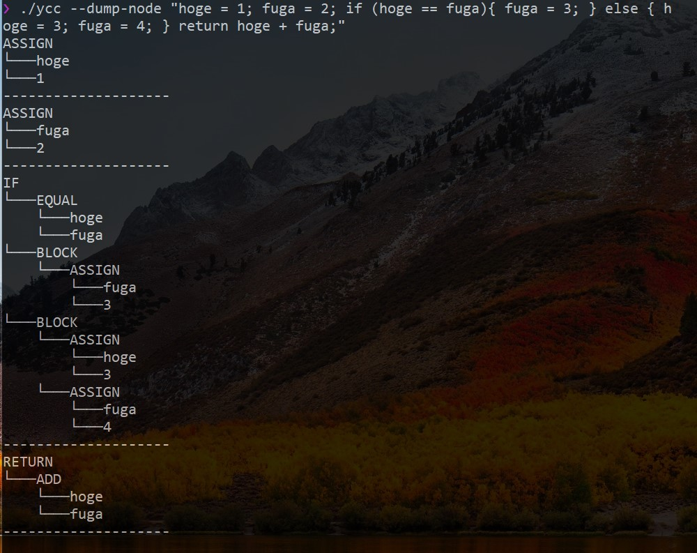

## TL;DR

今回は最近書いている C コンパイラの ycc(('y'は自分の名前に由来しています))についてについて書きます．

僕が C コンパイラなどというものを書こうと思ったのはある日，Rui Ueyama さんのこのページを見つけたからです．

[低レイヤを知りたい人のための C コンパイラ作成入門](https://www.sigbus.info/compilerbook)

あとは最近言語処理系の実装に燃える人を Twitter でよく観測するようになったからでしょうか．マジであの界隈はガチプロしかいない…

この Web ページでは C のソースを渡すとアセンブリを吐くコンパイラの作り方が紹介されています．電卓レベルから初めて徐々に機能を増やしながらコンパイラを開発するので，初心者でも取り組みやすくなっています．最高ですね．

## しくみとか

このコンパイラは標準ライブラリしか使っていないのでトークナイザからすべてスクラッチで書かないといけません．まぁ言語処理系の動きを勉強したいのでそれはそうなんですが

現時点の機能です:

-   扱えるのは整数だけ
-   四則演算とカッコの優先順位つき計算
-   if-else
-   外部ソースに定義した関数の呼び出し

では簡単にしくみを見てみましょう．

### tokenizer

空白を無視しながら意味のある単位(トークン)で切り分けて配列に詰めていきます．すべて読み終わるまで `while` で回すだけなのでまだ簡単ですが，識別すべき単位が増えてくるとしんどくなりそうですね…

### parser

トークナイズした配列を順に読んで，生成文法に従って再帰下降構文解析で構文木を組んでいきます．生成文法をうまく定めてやると演算子の優先順位を表現できるのですが，初めに見たときは感動と困惑が入り混じっていました．本当によくできているなぁと思います．

ここではポインタ使いまくりなのでちょっとだけポインタに慣れたかもしれません(ほんまか?)．

### code generator

構文木を根から再帰的にたどって，それぞれのノードに対応するアセンブリを出力します．関数呼び出しの実装のあたりから上記のサイトには出力すべきアセンブリが載っていないので現時点だとここが一番しんどいです．

## 日記

さて，ここからは僕が何日目にどんな機能を実装したのかを順に見ていきます．さすがに毎日開発しているわけではないので `git push` をした日を一日としてカウントします．

リポジトリはこちら:
[ikanago/ycc](https://github.com/ikanago/ycc/)

### 1 日目 (4/11)

大学入学早々こんなことをしていたんですね…先が思いやられます．

記念すべき first commit は数字リテラルを読んでそれを返すだけでした．

それから入力を解析して加減法ができるようになりました．これだけでも割とひとりで盛り上がっていました．

### 3 日目 (4/15)

この時点で構文木を構築してカッコ，乗除を含めた優先順位付きの計算ができるようになり，やっと電卓レベルのことができるようになりました．このときは木の構築を指示通りに書いていただけで，どんなふうに動作しているのかを理解しきれていませんでした．

### 7 日目 (5/20)

トークンを配列に格納していて任意長のプログラムに対応できなかったので，C++の `std::vector` のような構造体を実装しました．構造体のメンバに配列のポインタを持っていて，いっぱいになったら `realloc` するようになっています．これで任意の長さのプログラムを処理できるようになりました．

C の標準ライブラリには便利なデータ構造がほぼないので自前で実装しなければなりません． `vector` を実装したときは `void*` が分からなくて無限に悩んだ覚えがあります(これ未だにちゃんと理解してなさそう)．

### 11 日目 (5/26)

この日までにまず比較演算子を実装しました．

そして一文字の変数と `return` が使えるようになりました．変数の実装ですが，これは初めにアルファベット 26 文字分の変数領域をスタックに確保しているだけです．しかしこれでプログラムらしいものがコンパイルできるようになってグッと楽しくなってきました．

そこで任意の文字数の変数を実装するために `std::map` のような `Map` という構造体を作りました．

このころになってやっと構文木の構築が理解できるようになってきました．たぶんデバッグで鬼のようにステップ実行して木の上を走り回ったからでしょう．

### 14 日目 (6/1)

任意の文字数の変数を実装しました． `Map` に変数名と「スタックにおける RBP からのオフセット」を一組にして管理しました．変数を呼び出すときはオフセットが分かっていれば RBP の値から変数の値が入っているスタックのアドレスを特定できます．このへんからアセンブリ(というかスタック)の理解がしんどくなってきました．スタックのお絵描きをして遷移をなんとか理解していた気がします．

そろそろ意識的にコードをきれいに書かないとつらくなるくらいにコードが多くなってきました．

### 18 日目 (6/9)

`if` 文を実装しました( `else` はまだ)．そしてブロックを実装して， `if` のあとに複数の式を実行できるようにしました．だんだん様になってきましたがまだまだ道のりは長い…

いちいちデバッグするのがしんどいので，トークナイザの結果だけをダンプできるように `dump_token` 関数を作りました．これで「バグってるけどトークナイザは正常だ」ということを手軽に確認出来て便利です．

### 21 日目 (6/25)

外部の C ソースと一緒にコンパイルして，そこで定義されている関数を呼び出せるようにしました．まずは引数なし，そして引数ありでも呼び出せるようになりました．まだ関数定義はできません．

パーサはトークナイザよりデバッグが面倒(再帰だらけなので遷移を追うのにエネルギーを使う)ので， `dump_node` 関数を実装しました．根から順に再帰的に子を見やすく出力するだけです( `tree` コマンドみたいなやつ)．競プロのおかげでこういう処理をそこまで消耗せずに書けるようになっているかもしれません((木構造の問題はそんなに解いてませんが実装力の意味で))．デバッグ時に `dump_node` までうまくいっていればデバッグするのはコードジェネレータとアセンブリだけ，みたいにできてこれから少し楽になりそうです．我ながらいいツールができたなぁとか言っています．

### 22 日目 (6/27)

関数呼び出しができるようになったので関数定義を実装したのですが，定義した引数ありの関数をアセンブリで呼ぶとせぐふぉが出るのでうんうん唸っていました．デバッグをして変数を格納している `Map` がバグっていそうだなぁとはなったのですがよく分かりません．ところがヤケクソになって引数なしで関数定義をしたコードをコンパイルしてみると正常に動作しました．どうやら関数定義における引数の処理がうまくいっていないはずです．

これから ICPC と期末試験が控えているのでしばらく開発を中断したほうが良さそう…?

## まとめ

この記事は関数定義の実装がうまくいかなかったので息抜きに書きました．この開発の目標としてセルフホスト(作ったコンパイラでそれ自身をコンパイルする)を掲げているのですが，こうして振り返るとまだまだ道のりは遠いです．正直ゴールが全然見えてきません．頑張って来年の 4 月までに完成させたいですね．

このコンパイラ開発がうまくいったらアセンブラとかも組んでみたいです．コンパイラを作ったところでそれ以外の部分は結局 GCC に頼っているので… C 言語の処理系を完全に自作できたらいいですね(野望)．

これからも進捗がまとまったら記事にしようと思います．では…

## 追記

このブログを上げた次の日である 6/28 に，欠陥に気づいてちょっとソースコードをいじると引数ありの関数定義がうまく動くようになりました．再帰呼び出しも原理的にはうまくいくことが分かってはいたのですがいざフィボナッチ数列を食わせて正常に動作するのを見ると感動しました．

なんとか関数定義が完成して一安心です…! 一旦開発を中断する前にテスト方法の見直しとファイル入力による実行ができるようにしたいと思います．

それではまた!
