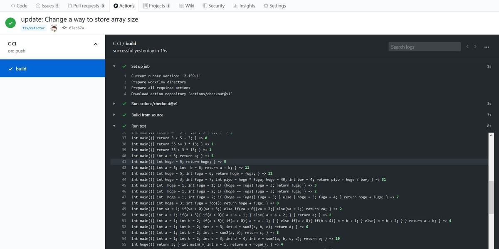

## お久しぶりです

前に 1 つ目の自作コンパイラの記事を出したのが 6 月下旬だったのでそこから 4 ヶ月経ったことになります．えっ，もうそんなに経ったんですか

[C コンパイラを自作する その 2](https://ikanago-blog.netlify.app/blog/c-compiler1.md)

以前は関数定義がうまくいったあたりで終わっていた気がします．そしてこの 4 ヶ月でファイル入力，`for`, `while`ループ，型，ポインタ，配列，そして文字列リテラルの実装をしました．こうして書き並べてみるとよくやった気もしますが道のりはまだまだ長く続いています．

それでは前回同様 commit をした日を 1 日としてカウントしながら振り返りたいと思います．リポジトリはこちら:

[ikanago/ycc](https://github.com/ikanago/ycc)

## 日記

### 23 日目(7/4)

この日は`while` ループを実装しました．gcc の吐くアセンブリと [低レイヤを知りたい人のための C コンパイラ作成入門](https://www.sigbus.info/compilerbook) をにらんで書くだけなので比較的実装しやすい機能です．繰り返し処理ができると一気にプログラミング言語っぽくなりました．

### 25 日目(7/15)

外部ファイルに記述したソースコードをコンパイルできるようになりました．C 言語でファイル IO を扱うのは初めてだったんですが結構ややこしいかった気がします．実はこの時の実装にはバグがあって，この 2 ヶ月後に修正されることになっています．

### 28 日目(7/19)

`for` ループを実装しました．`while` だけでも問題ないけどやっぱり欲しいので…

### 31 日目(8/2)

`&&`と`||`を実装しました．これ実はそれぞれがひとつの`if`ステートメントと似たようなアセンブリを吐くんですよね おもしろい

### 32 日目(8/3)

アドレス演算子`&`とポインタのデリファレンス演算子`*`を実装しました．ポインタの実装難しそう><ってなっていましたが意外と簡単でした．
まず`int`型の変数へのアクセス(スタックトップに積む)は

```asm
# int aに対してaを返す:
lea rax [rbp-4]             # raxにaのあるアドレスをロード
mov eax, DWORD PTR [rax]    # raxの値をアドレスとして見てeaxにそのアドレスにある値(a)をロード
```

一方`int*`型の変数は

```asm
# int a, int *b = &aに対して*bを返す:
lea rax [rbp-12]    # raxにbのアドレスをロード
mov rax [rax]       # raxの値をアドレスとして見てraxにそのアドレスにある値(b == &a)をロード
mov rax [rax]       # raxの値をアドレスとして見てraxにそのアドレスにある値(a)をロード
```

ポインタ変数 b には指し示している a のアドレスが入っているだけなので，一度 a のアドレスを引っ張ってきて，そのアドレスから値を引っ張ってくると終わりです．
ポインタのポインタに対しても`mov rax [rax]`をもう一度やるとうまくいくことが分かりますね．

### 36 日目(8/23)

今まで`int`型のサイズが 8byte だったので`int`は 4byte，`int*`は 8byte になるようにしました．サイズによってレジスタを指定する名前が変わるので逐一場合分けする必要があります．

ただし今回の実装では負数をうまく扱えていません．おそらく符号 bit とかの話が全く理解できていないのでこれは今後の課題です．

### 38 日目(8/25)

`int *a, *b`に対して`*a +*b`をするときに型のサイズの情報が AST の各ノード(演算子なども含む)に乗っていると嬉しかったので，AST を駆け回って各ノードに対して型をつける処理を書きました．ここで不正な計算(現時点ではポインタ変数同士をそのまま足すことくらい)を弾けるようにもなりました．

そして`sizeof`演算子を導入しました．ただし`sizeof(a)`で変数`a`のサイズは分かりますが`sizeof(int)`のようにしてある型のサイズを知ることはまだできません(実装を忘れていたのか…?)．これもそのうち実装すべき機能です．

### 39 日目(9/7)

いよいよ配列を実装しました．C 言語においては，「sizeof か単項&のオペランドとして使われるとき以外，配列は，その配列の先頭要素を指すポインタに暗黙のうちに変換される」(出典: [低レイヤを知りたい人のための C コンパイラ作成入門#配列からポインタへの暗黙の型変換を実装する](https://www.sigbus.info/compilerbook#%E9%85%8D%E5%88%97%E3%81%8B%E3%82%89%E3%83%9D%E3%82%A4%E3%83%B3%E3%82%BF%E3%81%B8%E3%81%AE%E6%9A%97%E9%BB%99%E3%81%AE%E5%9E%8B%E5%A4%89%E6%8F%9B%E3%82%92%E5%AE%9F%E8%A3%85%E3%81%99%E3%82%8B)ようです．

配列はメモリ上に連続したデータの集合ですから，先頭の要素から`i`進んだところに`i`番目の要素があります．配列`a`に対して，0 番目の要素のポインタは`a`，1 番目の要素のポインタは`a+1`，`i`番目の要素のポインタは`a+i`という調子で，それぞれの要素の値を取り出すには`*a`，`*(a+1)`，`*(a+i)`とすればよいです．実は`a[i]`は`*(a+i)`と等価であるとして定義されています．(この定義から a[i] == _ (a+i) == _ (i+a) == i[a]が成立します．実際 2[a] というコードはコンパイルも実行も問題なくできます．)

というわけで，`a[i]`を読んだら`*(a+i)`のノードを生やしていくことになります．機械的にこの変換を施しているだけなのでそりゃあ配列外参照も検知できない…のか…?(配列のサイズ超えてるかどうかはわかる気もするけど)．

### 40 日目(9/11)

みんなだいすきグローバル変数の時間です．現時点で構文的にトップレベルにあるのは関数定義とグローバル変数の 2 種類です．この 2 つは型名と識別子を読んだだけではまだ区別できず，関数の仮引数の `()` の有無を確認して初めて判別できます．(構文解析の場合分けが少なくなるので後発の言語が変数定義に let とかを使う気持ちがちょっと分かりました)

グローバル変数はローカル変数とは別で管理します．そしてアセンブリを出力するときも，データの保管場所や参照方法は互いに異なります．ここは gcc の出力をにらむとすぐに実装できました．

### 41 日目(9/12)

`char`型を実装しました．`'a'`のような文字リテラルをパースできるわけではありません．(本記事執筆時点でもまだできていません) 単に文字列を`char`型の配列として扱うためです．

### 42 日目(9/13)

前置の`++`と`--`や`+=`，`-=`を実装しました．`for`文でわざわざ`i=i+1`と書かなくてもよくなりました．

### 44 日目(9/17)

前々から気になっていた`GitHub Actions`という機能を使うことにしました．これは GitHub 上で提供されている CI ツールで，yaml で設定ファイルを書くと`push`や`pull request`ごとにテストが走って，コードがちゃんとテストをパスしたかを GitHub のページ上で確認できます．

手元と同じテストスクリプトを走らせているだけですが，いつでも正常性を確認出来たり，自分以外の人にコンパイラのレベルを示しやすくなると思って導入しました(単に使ってみたかったというのもある)．


そして 9/14 に文字列のパースを実装し終えていたので，コード生成をしました．今回もアセンブリをにらみながら実装しました．これでめでたく`printf("Hello, world!");`を出力できます!(では今までどうやって計算結果を出力していたかというと，結果をプログラムの終了コードをとして吐いて， echo \$? で確認していました．) Hello world を出力するのになかなか長い時間がかかりました…

### 46 日目(9/23)

今までは一度に 1 つか 2 つの機能を確認する単体テストしかありませんでしたが，複数の機能を詰め込んだ結合テストを書きました．次の日にはコンパイラの実装で使った C の組み込み関数の動作を確認するコードも入れて，コンパイラのコードがカバーされつつあることを実感しました．`strncmp()`とか`malloc()`とかが動いているのを見たときはかなり嬉しかったです．特に`malloc()`なんかは絶対バグると思い込んでいたので．

### 49 日目(10/6)

9/24 に行/ブロックコメントを導入したのですが，コンパイル対象のソースコードを文字列として読み込んだ時に末尾に`\001`のようなゴミが紛れ込んでくるというバグ(?)が発生しました．

以前まではファイルの入力を 1 行ごとにバッファに読み出して，自作の可変長文字列の構造体に`append`していました．このときにバッファをクリアせずに次の行を読み出しており，それが原因だろうと思って`memset()`で毎回バッファを初期化したのですがそれでも直りません．読み出している途中のバッファには`\001`のような異物はないのに，読み出し終えた文字列を見ると末尾に`\001`がいたのです．

さすがに意味が分からずキレかけたのですが，事前にファイルサイズを取得してそのサイズ分だけバッファを確保して(file_stat 構造体を使いました) 一気に読み込むことにしました．そうすれば異物の入る余地はないだろうと考えたのです．結果としてこれはうまくいって，バグを潰すことができました．めでたしめでたし．

## おわりに

これを書いた感想ですが，自分のやったことでもある程度時間が経つと細部を忘れてしまうことを実感しました．もっとコミットメッセージに動機とか解決策を詳細に書くべきですね．その時の自分は分かってもしばらく後の自分は理解できないことが多いです．(多いどころではないし，未来の自分はほぼ他人)

そしてコンパイラの方ですが，まだまだセルフホストに向けて実装すべき機能はたくさんあります．(少なくともコンパイラを書くために使った機能は実装しないといけません) 大きなところでは`struct`，`enum`，`switch`，キャストなどが残っています．現時点で「低レイヤを～」の記事に記載された機能は実装しつくしたはずなので，ここから先は自力でどうにかする必要がありますが，ここからが本番のような気もします．とは言ってもあまり気負わずに，じっくりやっていきたいと思っています．
